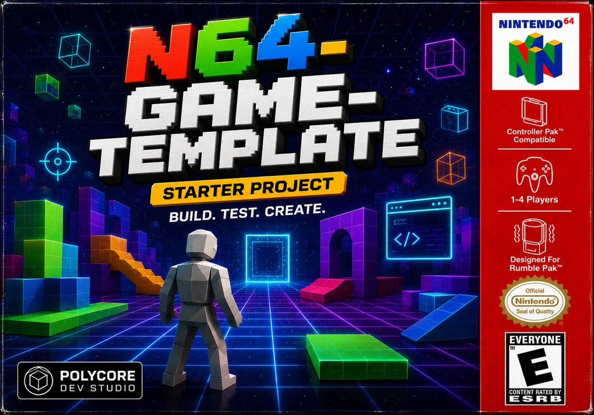
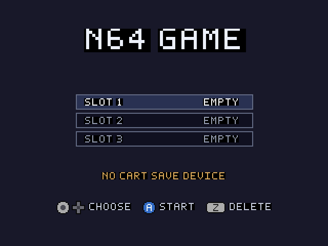
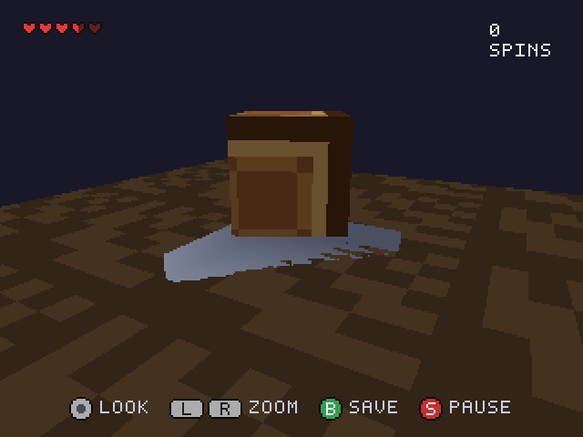
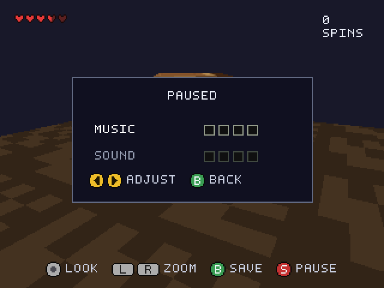
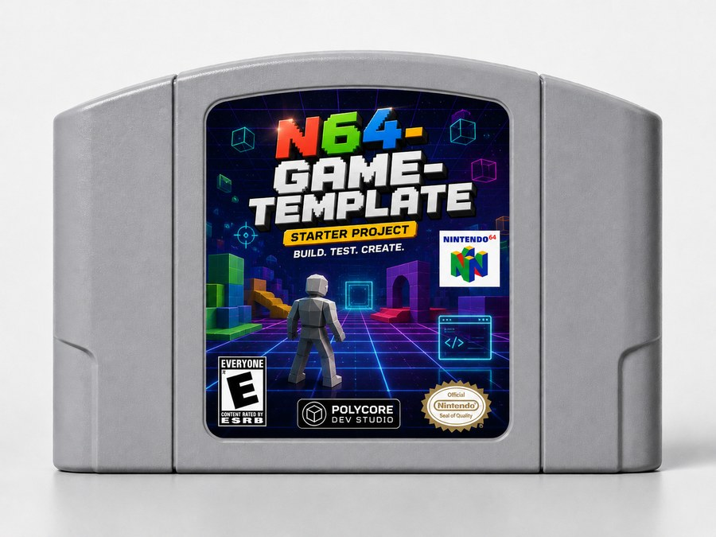

# N64 Game Template



**A starting point for Nintendo 64 games that runs on real hardware.** A small
C engine, a working demo game to replace, an asset pipeline, and the offline
tools to see what you are making without booting a console.

Targets a stock console — 4 MiB, no Expansion Pak. The starter game leaves
about 3 MiB of that free. It is also set up to be handed straight to a coding
agent — see [vibe coding it](#vibe-coding-it).

| | | |
| --- | --- | --- |
|  |  |  |

*The starter game, straight out of the box. Everything above is drawn by the
~600 lines in `game/` — the title card, the scene, the HUD and the pause menu —
using engine pieces you keep.*

## What you get

**An engine** (`engine/`) — boot, video and the frame loop; a font and text
drawing; controller-button sprites, legends, check marks and meters; input with
edge detection and a stick that behaves; flashcart saving with transactional
writes; streamed music and sound effects; and a freeze watchdog that makes a
locked-up console say what killed it.


Every control the console has, as a sprite, so a screen can name a button by
drawing it instead of spelling it out. They cost a dozen fill rectangles each —
no texture load — and they compose into legend rows that measure themselves:


**A game** (`game/`) — a title screen with save slots, a textured crate turning
over a ground plane, a HUD and a pause menu. About 600 lines, all of it meant to
be deleted once you have read it.

**Tools** — a software rasteriser that draws your models on your machine in a
quarter of a second, a sprite previewer that reads the engine's own tables, and
a scripted emulator harness for repeatable screenshots.

## Build it

Build the SDK image once:

```sh
docker build --platform linux/amd64 -t n64-nusys-build:local -f docker/N64SDK.Dockerfile .
```

Then the ROM:

```sh
docker run --rm --platform linux/amd64 -v "$PWD:/work" -w /work n64-nusys-build:local make -j4
```

Output is `build/n64game.n64`. With a SummerCart64 attached, `./live-load`
builds and streams to cart RAM; `./perma-load` writes it to the SD card.

Full setup, deployment and the texture/music/SFX pipelines:
[docs/building.md](docs/building.md).



That is the point of the flashcart path: the ROM this builds is a real ROM. It
boots on a real console from a real cartridge, at the real frame rate, with the
real RDP — which is the only place some of the faults in
[docs/hardware.md](docs/hardware.md) will ever show themselves.

Emulators are for iterating on layout and logic. Hardware is the arbiter.

<br clear="right">

*Box and cartridge artwork is a mock-up, not a shipping product — see
[Credits](#credits).*

## Make it yours

1. **Name it.** `NAME` and `STORAGE_DIR` in the [Makefile](Makefile), and
   `GAME_TITLE` in [game/include/game.h](game/include/game.h).
2. **Read [game/src/game.c](game/src/game.c).** It is the whole contract with
   the engine: `gameInit`, `gameUpdate`, `gameDraw`.
3. **Replace [game/src/scene.c](game/src/scene.c)** with your own geometry, and
   [game/src/hud.c](game/src/hud.c) with your own screens.
4. **Draw your own tiles** in [generate_assets.py](generate_assets.py), or
   import a PNG atlas — see [docs/custom-textures.md](docs/custom-textures.md).

Everything under `engine/` you keep. Everything under `game/` you delete.

## Vibe coding it

This is a good template to point a coding agent at, and deliberately so.

The hard part of N64 development is not the C. It is a handful of rules that
are invisible in the code and only fail on real hardware — don't interleave
fills and text, double-buffer anything the RSP reads, multiply by `delta`. An
agent writing N64 code from general knowledge gets all three wrong, and those
bugs are the worst kind: fine on an emulator, intermittent on a console, and
impossible to attribute after the fact.

So they are written down where an agent will actually read them.
[CLAUDE.md](CLAUDE.md) carries the rules and the workflow; every engine header
explains why its function is shaped the way it is rather than just what it
does; and the build runs `check_ram.py`, so a change that would overrun the
framebuffers fails loudly instead of quietly corrupting memory.

The preview tools matter more here than they first appear. An agent can render
the sprites, models and legends it just wrote — straight from the source, in a
quarter of a second, without building a ROM — and then look at the result. That
closes the loop that is usually missing.

And the `engine/` and `game/` split bounds the blast radius. Point it at
`game/`, leave `engine/` alone, and the worst case is a demo that needs
rewriting rather than a runtime that needs debugging.

## Three things the hardware will teach you the hard way

**Multiply by `delta`.** `gameUpdate` runs on every video retrace; `gameDraw`
runs only when the RSP is idle. On a heavy scene that is 60 updates and 20
frames a second. Anything advanced by a fixed amount per call speeds up when
the scene gets simpler.

**Never interleave fills and text.** Reconfiguring the RDP between fill mode
and texture mode mid-screen is a hazard that locks real consoles and does
nothing at all on emulators. Draw every rectangle, then every glyph. This is
why a legend is two calls.

**Double-buffer anything the RSP reads.** The task drawing the previous frame
may still be walking a matrix you are about to overwrite. Index it on `dl_no`.

The rest is in [docs/engine.md](docs/engine.md).

## Tools

`tools/preview` draws the game's own data on your machine — no console, no
emulator, about a quarter of a second:

```sh
tools/preview/buttons.py --legend --crt
```

That one reads the sprite tables straight out of `engine/src/ui.c` and the
legend out of `game/src/hud.c`, so the picture is what the ROM draws rather
than a drawing of what it should be — both button images above were made this
way, without building a ROM.

`--crt` fakes composite video: full-bandwidth luma, chroma smeared sideways.
It is the cheap way to find out whether a one-pixel outline survives a
television, which is the part emulators flatter most.


Same row, same data, through the fake signal. The dark outline holds and the
letters stay legible — that is what it is there to tell you.

`tools/emu` drives mupen64plus through a scripted controller timeline —
button presses and stick positions counted in rendered frames — so a run needs
no keyboard, no window focus, and lands on the same screens every time:

```sh
tools/emu/run.sh tools/emu/scripts/tour.txt
```

That is where the three screenshots at the top came from, one labelled PNG per
`shot` in the script. Nine seconds, unattended, repeatable.

Neither tool settles performance or RDP behaviour. Those belong on hardware.

## Docs

| | |
| --- | --- |
| [Engine](docs/engine.md) | The API, and the hardware rules behind its shape |
| [Building](docs/building.md) | SDK, ROM builds, flashcart deployment, asset pipelines |
| [Hardware notes](docs/hardware.md) | Freeze diagnostics and faults emulators don't reproduce |
| [RAM budget](docs/ram-budget.md) | Where the console's memory goes |
| [Offline preview](docs/offline-preview.md) | `tools/preview` reference |
| [Emulator screenshots](docs/emulator-screenshots.md) | `tools/emu` script grammar |
| [Custom textures](docs/custom-textures.md) | Art-to-cartridge workflow |

## Credits

Cartridge file access via devwizard's
[libcart](https://github.com/devwizard64/libcart); the `engine/src/ff` and
`engine/include/ff` directories come from that project. The toolchain is
assembled from the public
[ModernN64SDKArchives](https://github.com/ModernN64SDKArchives/n64sdkmod)
archive.

The engine was extracted from Mine64, a finished N64 game — it is the part of
that game that was not about blocks. That is why the comments in `engine/` are
as specific as they are: most of them are recording something a real console
did, usually the hard way.

The box and cartridge images are a fan-made mock-up, for fun, of what this
project would look like as a retail release. It is not a retail release, it is
not licensed, approved, or endorsed by Nintendo, and it has not been rated by
the ESRB. Nintendo 64, the N64 logo, Controller Pak, Rumble Pak and the
Official Nintendo Seal are trademarks of Nintendo; the ESRB rating icons are
trademarks of the Entertainment Software Association. They appear here only as
part of that period-accurate pastiche.
